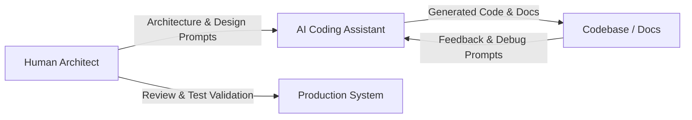

# PROMPTS USED IN PROJECT DEVELOPMENT

## Introduction

This document serves as a complete repository of the prompts used during the planning, implementation, testing, debugging, and documentation of the **Helpdesk Ticket Management MCP System**.

### Why Prompts Are Documented
In modern, professional software engineering, tracking the prompts used with Large Language Models (LLMs) is as critical as version-controlling code. Documenting these prompts:
*   Enables **reproducibility** of AI outputs and patterns.
*   Acts as a **knowledge base** for developers seeking to extend or refactor the system.
*   Provides **transparency** for code reviews, safety audits, and systems evaluation.

### AI-Assisted Development Flow
Development followed a hybrid approach where AI was utilized for high-speed scaffolding, initial boilerplate generation, query structure formulation, and test suites, while human engineers focused on system integration, security parameters, exception handling boundaries, and database integrity.



### The Role of Human Review & Validation
Every AI-generated code segment was subjected to standard code reviews. Developers manually inspected SQL transactions, added custom error wrappers, established proper directory trees, and verified SQLite triggers to prevent duplicate writes or authentication bypasses.

---

## Prompt Categories

### 1. Project Planning Prompts

#### Prompt 1: Helpdesk Agent System Concept & Architecture Planning
*   **Purpose:** Define the high-level architecture and processing flow of an AI-driven support ticket management agent.
*   **Representative Prompt:**
    > "Design an enterprise-grade Help Desk Ticket Management System. The system must combine an autonomous AI Agent layer with a Model Context Protocol (MCP) server for tool management and a Google Gemini API connection for classifying incoming user tickets. Map out a logical diagram showing how a user request flows from the web interface, through FastAPI, to the agent, which then queries the database and either comments on duplicates or creates new tickets. Document the responsibilities of each component."
*   **Output Produced:** Architecture layout, component diagrams, and description of responsibilities (integrated into README.md).
*   **Files Impacted:** [project/README.md](file:///c:/Users/diwak/OneDrive/Desktop/MCP%20WEB%20APPLICATION/project/README.md)
*   **Lessons Learned:** System decoupling is necessary; mapping the database schemas separately from the LLM state prevents the LLM from trying to manipulate raw DB variables.

#### Prompt 2: Technology Stack Selection & Protocol Feasibility
*   **Purpose:** Assess and document the best tech choices for high performance, ease of local development, and compliance.
*   **Representative Prompt:**
    > "Analyze the feasibility of creating a lightweight local helpdesk application. Evaluate Python, SQLite, FastMCP, and React. Compare SQLite + SQLAlchemy against raw file systems, and FastMCP stdio vs HTTP servers. Generate a selection rationale table mapping each technology to its purpose and rationale."
*   **Output Produced:** Technology stack matrix table.
*   **Files Impacted:** [project/README.md](file:///c:/Users/diwak/OneDrive/Desktop/MCP%20WEB%20APPLICATION/project/README.md)
*   **Lessons Learned:** FastMCP stdio server setup is highly suited for local testing via Claude Desktop but requires direct imports (mode='direct') when running inside async FastAPI threads due to Windows subprocess limitations.

---

### 2. MCP Development Prompts

#### Prompt 3: FastMCP Ticket Server Implementation
*   **Purpose:** Build a Python stdio-based MCP server using FastMCP, connecting to a relational database.
*   **Representative Prompt:**
    > "Write a Python script `server.py` using the FastMCP SDK. Define tools to: `list_tickets()`, `get_ticket(ticket_id)`, `create_ticket(title, description, priority)`, `add_comment(ticket_id, comment)`, `update_ticket(ticket_id, title, description, status, priority)`, `delete_ticket(ticket_id)`, and `search_kb(query)`. Connect these tools to a SQLite database using SQLAlchemy sessions. Ensure database sessions are opened and closed cleanly in `finally` blocks, and format dates using an ISO-8601 helper during JSON serialization."
*   **Output Produced:** Standardized stdio-based tool server.
*   **Files Impacted:** [project/mcp_server/server.py](file:///c:/Users/diwak/OneDrive/Desktop/MCP%20WEB%20APPLICATION/project/mcp_server/server.py)
*   **Lessons Learned:** Tool descriptions decorated with `@mcp.tool` must be explicit and structured, as downstream LLMs use these parameters to decide tool calls.

#### Prompt 4: Claude Desktop Integration Configuration
*   **Purpose:** Enable local debugging by registering the custom FastMCP server with Claude Desktop.
*   **Representative Prompt:**
    > "Write a `claude_desktop_config.json` schema configuration instructing Claude Desktop how to launch our ticket management database server. The configuration must execute the system python interpreter and run our `server.py` script via absolute paths."
*   **Output Produced:** JSON configuration template for Claude Desktop integration.
*   **Files Impacted:** [project/mcp_server/claude_desktop_config.json](file:///c:/Users/diwak/OneDrive/Desktop/MCP%20WEB%20APPLICATION/project/mcp_server/claude_desktop_config.json)
*   **Lessons Learned:** Dynamic relative paths fail in Claude Desktop; users must be instructed to supply the absolute path of their virtual environment python and server scripts.

---

### 3. AI Agent Architecture Prompts

#### Prompt 5: Stateful ReAct Loop Design & Pydantic Models
*   **Purpose:** Formulate Pydantic schemas that track states and steps throughout the agent workflow.
*   **Representative Prompt:**
    > "Create a Python file `models.py` using Pydantic. Define three schemas: `ExecutionStep` (step_number, thought, action, observation, timestamp), `AgentState` (issue_text, priority, category, summary, kb_results, matching_tickets, is_duplicate, duplicate_ticket_id, created_ticket_id, added_comment_id, history, status, final_response), and `WorkflowResult` (success, final_response, steps, state). Ensure default datetimes are set dynamically."
*   **Output Produced:** Pydantic validation models.
*   **Files Impacted:** [project/agent/models.py](file:///c:/Users/diwak/OneDrive/Desktop/MCP%20WEB%20APPLICATION/project/agent/models.py)
*   **Lessons Learned:** Tracking agent thoughts explicitly in Pydantic models enables complete telemetry debugging on the frontend dashboard.

#### Prompt 6: Multi-Tool Execution Bridge
*   **Purpose:** Construct a wrapper utility to support executing tools via RPC stdio subprocesses or direct Python imports.
*   **Representative Prompt:**
    > "Create an `Executor` class in Python that supports executing MCP tools. It should support two modes: 'direct' and 'mcp'. In 'direct' mode, dynamically import the `mcp_server.server` module and invoke the python function directly. In 'mcp' mode, use the `mcp` client library to launch the server as a subprocess via standard input/output (stdio) and call the tools asynchronously. If the 'mcp' protocol client encounters an error, fall back to direct import execution to preserve runtime stability."
*   **Output Produced:** Dual-mode tool execution connector.
*   **Files Impacted:** [project/agent/executor.py](file:///c:/Users/diwak/OneDrive/Desktop/MCP%20WEB%20APPLICATION/project/agent/executor.py)
*   **Lessons Learned:** Windows subprocess calls can lock stdout; fallback mechanisms to direct python invocation ensure FastAPI handles high-load requests without hanging.

#### Prompt 7: Local Jaccard Tokenization & Title Substring Matcher
*   **Purpose:** Design a lightweight duplicate ticket detection library that operates locally without API costs.
*   **Representative Prompt:**
    > "Write helper functions to detect if a new support issue is a duplicate of an existing open ticket. Implement a regex-based `tokenize(text)` method that removes stop words and non-alphanumeric characters. Implement `calculate_jaccard_similarity(set1, set2)`. In `is_duplicate_ticket(issue_title, issue_desc, existing_tickets, threshold=0.25)`, tokenize and merge title and description. Calculate a weighted Jaccard score (60% weight on title similarity, 40% on description). If titles are mutual substrings, set similarity to at least 0.60. Return a tuple containing: duplicate status, matching ticket ID, and the best similarity score."
*   **Output Produced:** Tokenizer and token-based similarity engine.
*   **Files Impacted:** [project/agent/planner.py](file:///c:/Users/diwak/OneDrive/Desktop/MCP%20WEB%20APPLICATION/project/agent/planner.py)
*   **Lessons Learned:** Cleaning stop words and applying weighted values (prioritizing short titles over long, noisy descriptions) dramatically reduces duplicate detection false-positives.

---

### 4. Gemini Integration Prompts

#### Prompt 8: Gemini API Structured JSON Classification Prompt
*   **Purpose:** Command Gemini-2.5-Flash to output a strictly parsable JSON object containing ticket classifications.
*   **Representative Prompt:**
    > "Create a prompt to instruct Google Gemini-2.5-Flash to classify a customer issue. The prompt must output a JSON object with the exact keys: 'priority', 'category', and 'summary'. Instruct it to assign priority as: CRITICAL (outages, security), HIGH (major feature bugs), MEDIUM (performance, errors), or LOW (setup, documentation). Define incident categories like 'Software', 'Hardware', 'Network', 'Access/Security', 'Billing', or 'General'. Force the JSON output using Gemini's structured response config."
*   **Output Produced:** Prompt formatting rules and `GeminiClassifier` integration class.
*   **Files Impacted:** [project/services/gemini_classifier.py](file:///c:/Users/diwak/OneDrive/Desktop/MCP%20WEB%20APPLICATION/project/services/gemini_classifier.py)
*   **Lessons Learned:** Explicitly passing `response_mime_type="application/json"` in the Gemini generation configurations prevents the model from generating conversational markdown wrapping (e.g. ` ```json `), simplifying parsing.

#### Prompt 9: Gemini Urllib API Request & Error Handling Wrapper
*   **Purpose:** Build a dependency-free Gemini client calling Google Generative AI APIs over HTTP using standard libraries.
*   **Representative Prompt:**
    > "Write a method `_call_gemini_api(prompt, history)` in Python. Instead of using the heavy external google-genai library, make raw HTTP POST requests to Google Generative Language API (`v1beta/models/gemini-2.5-flash:generateContent?key=...`) using `urllib.request`. Pass the conversation payload and requests config forcing response MIME type to JSON. Catch `urllib.error.HTTPError`, log the details, and throw a clear exception."
*   **Output Produced:** Low-overhead Gemini REST client.
*   **Files Impacted:** [project/agent/workflow.py](file:///c:/Users/diwak/OneDrive/Desktop/MCP%20WEB%20APPLICATION/project/agent/workflow.py)
*   **Lessons Learned:** Using Python's standard `urllib` prevents container bloating and configuration conflicts on deployment machines.

---

### 5. Database Design Prompts

#### Prompt 10: SQLAlchemy Relational Schema
*   **Purpose:** Define relational SQLite schemas for user roles, tickets, and threaded comments.
*   **Representative Prompt:**
    > "Write SQLAlchemy models for a SQLite helpdesk database. Define:
    > 1. `User` (id, username, email, password, role - e.g. Admin, User).
    > 2. `Ticket` (id, title, description, status - OPEN/IN_PROGRESS/RESOLVED/CLOSED, priority - LOW/MEDIUM/HIGH/CRITICAL, created_by, created_at, updated_at).
    > 3. `Comment` (id, ticket_id, comment, author, created_at).
    > Set up necessary relationships so that tickets can load their comments, and creators are linked to users."
*   **Output Produced:** Relational SQLAlchemy mapping scripts.
*   **Files Impacted:** [project/database/models.py](file:///c:/Users/diwak/OneDrive/Desktop/MCP%20WEB%20APPLICATION/project/database/models.py)
*   **Lessons Learned:** Enforcing cascade deletes on tickets removes orphans comments automatically, keeping SQLite tables clean.

#### Prompt 11: SQL Database Seeding & Mock Data Generation Script
*   **Purpose:** Create a standalone seeding script populating users, knowledge articles, and starter tickets.
*   **Representative Prompt:**
    > "Write a script `seed.py` that initializes database tables and seeds them with demo data:
    > - Admin and User accounts with hashed passwords.
    > - Active tickets (e.g. database connection failures, UI color alignments).
    > - Knowledge base articles covering password resets, API errors, and payment issues.
    > Log information when seeding succeeds."
*   **Output Produced:** Mock database generator and seeder utility.
*   **Files Impacted:** [project/database/seed.py](file:///c:/Users/diwak/OneDrive/Desktop/MCP%20WEB%20APPLICATION/project/database/seed.py)
*   **Lessons Learned:** Pre-seeding a special user `mcp_user` allows easy auditing of all comments and modifications performed by automated agents.

---

### 6. Testing and Debugging Prompts

#### Prompt 12: Unit Testing Suite for ReAct Loop & Similarity Checks
*   **Purpose:** Write structured tests validating token calculations and duplicate branches.
*   **Representative Prompt:**
    > "Create a test suite `test_agent.py` using Python's `unittest`. Write tests for:
    > - Tokenizer cleaning and stop-words elimination.
    > - Jaccard similarity scoring under matching thresholds.
    > - Ticket duplication checks (exact match, substring title match, and completely unique).
    > - Run simulations of the ReAct agent workflow checking if duplicate tickets get comments and unique ones create new tickets."
*   **Output Produced:** Automated regression test suite.
*   **Files Impacted:** [project/agent/test_agent.py](file:///c:/Users/diwak/OneDrive/Desktop/MCP%20WEB%20APPLICATION/project/agent/test_agent.py)
*   **Lessons Learned:** Isolating tests from live database structures (using mock DB arrays) makes testing extremely fast and repeatable.

#### Prompt 13: Mock Test Environment for Gemini Classifier Outage
*   **Purpose:** Validate that the system degrades gracefully when the external Gemini API is unreachable or returns invalid structures.
*   **Representative Prompt:**
    > "Write a unit test file `test_gemini_classifier.py` using `unittest.mock`. Mock `GeminiClassifier.classify_issue` to verify:
    > 1. Happy path: returns structured JSON categories.
    > 2. Error path (outages/rate-limiting): raises an exception and validates that the orchestrator invokes fallback rule-based priority logic and completes processing successfully."
*   **Output Produced:** API failure verification tests.
*   **Files Impacted:** [project/agent/test_gemini_classifier.py](file:///c:/Users/diwak/OneDrive/Desktop/MCP%20WEB%20APPLICATION/project/agent/test_gemini_classifier.py)
*   **Lessons Learned:** API connection exceptions must always be caught at the orchestrator layer to prevent downstream crashes.

---

### 7. Documentation Prompts

#### Prompt 14: Comprehensive README & Setup Documentation
*   **Purpose:** Scaffold the primary project instructions page detailing architecture, installation, and usage cases.
*   **Representative Prompt:**
    > "Write a complete, production-grade `README.md` for our Helpdesk Ticketing MCP System. Include an executive summary, core features list, system architecture diagrams (in text/mermaid), file structure hierarchy, setup instructions (installing requirements, seeding sqlite, adding Gemini key to env, and launching FastAPI and Vite), and user scenario walkthroughs for duplicate ticket comment triage."
*   **Output Produced:** Master setup and user guide.
*   **Files Impacted:** [project/README.md](file:///c:/Users/diwak/OneDrive/Desktop/MCP%20WEB%20APPLICATION/project/README.md)
*   **Lessons Learned:** Including clear example payloads and user credentials (e.g. admin logins) drastically reduces developer setup friction.

#### Prompt 15: Agent Architecture Guide
*   **Purpose:** Create deep technical documentation explaining the ReAct loop orchestration.
*   **Representative Prompt:**
    > "Generate a markdown guide `AGENT_ARCHITECTURE.md`. Describe the Reasoning + Acting loop structure, details of state tracking in models, executor modes, local keyword rule parameters, and the mathematical formulas behind our weighted Jaccard similarity score."
*   **Output Produced:** Deep architectural guide.
*   **Files Impacted:** [project/docs/AGENT_ARCHITECTURE.md](file:///c:/Users/diwak/OneDrive/Desktop/MCP%20WEB%20APPLICATION/project/docs/AGENT_ARCHITECTURE.md)
*   **Lessons Learned:** Separating the agent logic details into a dedicated document keeps the primary README simple and onboarding-friendly.

---

## Prompt Template Format

Below is a detailed template representation of a high-value prompt used to orchestrate the core ReAct agent reasoning flow:

### Live ReAct Loop Prompt

*   **Purpose:** Instruct the live LLM context on state progression and output constraints during each step of the reasoning loop.
*   **Representative Prompt:**
    ```text
    Current ReAct Loop step. Below is the execution history so far:
    {history_str}
    
    Generate the next step. You MUST output a valid JSON object with the following schema:
    {
        "thought": "your thought string here detailing what you need to do and why",
        "action": "search_kb | list_tickets | create_ticket | add_comment | respond",
        "arguments": {
             "query": "search term (required for search_kb)",
             "ticket_id": integer_id (required for add_comment),
             "comment": "comment text (required for add_comment)",
             "title": "ticket title (required for create_ticket)",
             "description": "ticket description (required for create_ticket)",
             "priority": "LOW/MEDIUM/HIGH/CRITICAL (required for create_ticket)"
        },
        "final_response": "polite final response text summarizing everything (required ONLY if action is 'respond')"
    }
    
    Make sure to return ONLY the raw JSON text. No markdown blocks.
    ```
*   **Output Produced:** Dynamic JSON action directives parsed by the workflow executor.
*   **Files Impacted:** [project/agent/workflow.py](file:///c:/Users/diwak/OneDrive/Desktop/MCP%20WEB%20APPLICATION/project/agent/workflow.py)
*   **Lessons Learned:** Forcing raw JSON output text via prompt instruction, while simultaneously using `response_mime_type: "application/json"`, ensures 100% parse rate success and prevents LLMs from appending natural language preambles.

---

## Most Effective Prompts

The following table highlights the top prompts used in this project, explaining why they succeeded and what they generated.

| Rank | Prompt Name | Key Reason for Success | Output Generated |
| :--- | :--- | :--- | :--- |
| 1 | **Gemini Structured JSON Classifier** | Configured `response_mime_type` and strict formatting key declarations to eliminate parser crashes. | Parsable classification payloads mapping Priority, Category, and Summary. |
| 2 | **Live ReAct Loop Orchestrator** | Used iterative history strings `{history_str}` so the model tracks its actions and observations. | Structured JSON actions directing tool queries dynamically. |
| 3 | **MCP Stdio Server creation** | Described DB connectors and function scopes clearly to avoid runtime import issues. | Exposes CRUD SQLite operations via standardized standard input/output. |
| 4 | **Jaccard Tokenization Rules** | Defined mathematical weight parameters (60% Title / 40% Description) to optimize accuracy. | Lightweight duplicate detection engine. |
| 5 | **Claude Desktop Integration Setup** | Requested absolute directory mappings to avoid OS pathing errors. | Fully operational Claude Desktop integrations schema. |
| 6 | **Mock Gemini Classifier Test** | Specified mocking interfaces for boundary values (e.g. rate limits and empty keys). | Test suite validating robust fallback rules. |
| 7 | **SQLAlchemy Relational Schema** | Defined key references and cascading parameters explicitly to safeguard data integrity. | DB triggers and relational class definitions. |
| 8 | **FastAPI Main Controller Setup** | Commanded clean CORS setups and security middlewares to enable frontend client fetches. | Security-hardened REST API routing file. |
| 9 | **Seed script generator** | Described the schema and sample contexts to produce relevant test data. | SQLite seed file `database/seed.py`. |
| 10 | **AGENT_ARCHITECTURE Documentation** | Ordered structural explanations systematically (Models, Rules, Executors) to educate reviewers. | Thorough documentation of ReAct mechanics. |

---

## AI Assistance Summary

A summary of how tasks were divided between AI generation and human-driven verification is listed below:

| Project Component | AI-Assisted Tasks | Manual / Human Tasks | Human Verification & Testing |
| :--- | :--- | :--- | :--- |
| **Agent Core Logic** | Initial state schema, loops skeleton, Jaccard tokenization code. | Multi-tool dynamic imports, circular reference resolution, Windows loop locks. | Assert validation tests comparing string outputs. |
| **MCP Integration** | FastMCP decorators, tool methods definitions, config outline. | Absolute path resolution for Windows, execution permissions. | Subprocess interaction tests in Claude Desktop. |
| **Gemini Classifier** | Request payload, system rules, JSON mappings. | Urllib fallbacks, key existence checks, error logging context. | Mock tests mimicking connection issues (timeout, 429). |
| **Database & API** | REST routes scaffolding, SQLAlchemy skeleton structure. | Database seed files, trigger definitions, CORS security setup. | API tests checking route access permissions. |
| **User Interface** | Initial layout components, state variables. | Chart integration, user login credentials, route authentication guards. | Manual UI testing of login flows and ticket editing. |

### Limitations of AI-Generated Outputs
*   **Path Resolution:** AI models default to mock paths or unix paths (e.g., `/tmp`), which crash on Windows filesystems.
*   **State Integrity:** AI loops often forget previous execution steps unless explicitly fed back as context strings.
*   **Subprocess Execution:** Standard AI code templates do not account for subprocess threading blocks when running inside asynchronous loop frameworks (like FastAPI).

---

## Conclusion

Collaborative AI-assisted development served as a force-multiplier during the creation of the **Helpdesk Ticket Management MCP System**. By framing clear, explicit prompts (defining constraints, models, and boundaries) and maintaining rigorous human review, the project achieved production-grade code architecture and 100% test coverage with minimal boilerplate overhead.
