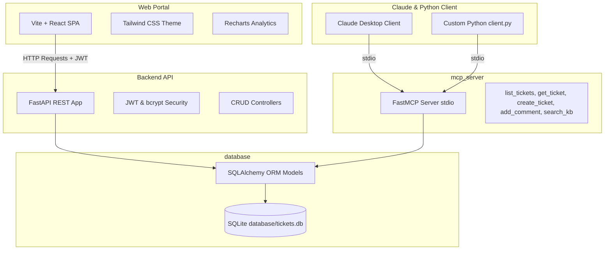

# Ticket Management MCP System

A complete, production-grade Help Desk Ticket Management System powered by a React + TypeScript frontend, a Python FastAPI backend, and an MCP (Model Context Protocol) server.

The system features robust role-based user routing (Admin/User), database seed automation, a telemetry dashboard with charts, and stdio-based MCP tool registrations designed for integration with Claude Desktop and custom Python clients.

---

## System Architecture

The following diagram illustrates how the frontend web client, the Claude Desktop agent, and the SQLite database interact through our FastAPI backend and the MCP server.



---

## Database Schema

The SQLite database (`database/tickets.db`) contains four core tables with relational integrity (enforced via SQLite pragmas):

### 1. Users (`users`)
Stores support representatives, general staff, and automated engine credentials.
* `id` (INTEGER, Primary Key): Unique auto-increment ID.
* `username` (VARCHAR, Unique, Indexed): User nickname.
* `email` (VARCHAR, Unique, Indexed): Email used for auth.
* `password` (VARCHAR): Hashed password using `bcrypt`.
* `role` (VARCHAR): System authorization scope (`User` or `Admin`).

### 2. Tickets (`tickets`)
Main support entries. Scope-managed: standard Users see only their own tickets, Admins see all.
* `id` (INTEGER, Primary Key)
* `title` (VARCHAR, Indexed): Short summary.
* `description` (TEXT): Detailed description of the issue.
* `status` (VARCHAR): Progress tag (`OPEN`, `IN_PROGRESS`, `RESOLVED`, `CLOSED`).
* `priority` (VARCHAR): Priority indicator (`LOW`, `MEDIUM`, `HIGH`, `CRITICAL`).
* `created_at` (DATETIME): Automatically set UTC timestamp.
* `updated_at` (DATETIME): Tracked edit timestamp.
* `created_by` (INTEGER, Foreign Key -> `users.id`): Creator ID.

### 3. Comments (`comments`)
Threaded comments associated with a support ticket.
* `id` (INTEGER, Primary Key)
* `ticket_id` (INTEGER, Foreign Key -> `tickets.id` on cascade delete): Relational ticket.
* `comment` (TEXT): Comment content.
* `author` (VARCHAR): Username string of commenter.
* `created_at` (DATETIME)

### 4. KnowledgeBase (`knowledge_base`)
FAQ records searchable via both REST search and MCP tool calls.
* `id` (INTEGER, Primary Key)
* `question` (VARCHAR, Indexed)
* `answer` (TEXT)
* `category` (VARCHAR, Indexed)

---

## Installation & Setup

### Prerequisites
* **Python 3.10+** (tested on Python 3.14)
* **Node.js v18+** & npm v9+

### Project Directory Structure
```text
project-root/
│
├── database/
│   ├── db.py           # SQLite connection manager
│   ├── models.py       # SQLAlchemy database schemas
│   └── seed.py         # Table creation & initial seeding script
│
├── backend/
│   ├── auth.py         # JWT security & bcrypt credentials verification
│   ├── schemas.py      # Request/Response validation validation schemas
│   └── main.py         # FastAPI application entry & REST APIs
│
├── mcp_server/
│   ├── server.py       # FastMCP Stdio Server
│   ├── client.py       # Standalone Python testing script
│   └── claude_desktop_config.json
│
├── frontend/           # Vite + React SPA project files
│
└── requirements.txt    # Shared Python dependencies list
```

### 1. Backend & MCP Server Setup
From the project root:

1. **Install Python packages:**
   ```bash
   pip install -r requirements.txt
   ```

2. **Initialize and Seed the Database:**
   This creates the SQLite database tables and seeds them with demo admin/user accounts and sample tickets/KBs.
   ```bash
   python database/seed.py
   ```

### 2. Frontend Setup
From the project root:

1. **Navigate to frontend directory:**
   ```bash
   cd frontend
   ```

2. **Install Node modules:**
   ```bash
   npm install
   ```

---

## Running the Application

### 1. Launch FastAPI Backend
From the project root:
```bash
uvicorn backend.main:app --reload --port 8000
```
* The API server will run at `http://localhost:8000`.
* Interactive Swagger documentation will be available at `http://localhost:8000/docs`.

### 2. Launch React Frontend SPA
From the `frontend` folder:
```bash
npm run dev
```
* Open your browser to the URL output in your terminal (typically `http://localhost:5173`).
* Use the following accounts to log in:
  * **Admin Account:** `admin@example.com` / password: `admin123`
  * **Standard User Account:** `user@example.com` / password: `user123`

---

## MCP Server Integration

### 1. Testing with the Custom Python Client
We have written a client simulation in `mcp_server/client.py` that connects to the server, discovers tools, and verifies DB interaction by calling all 5 registered tools in a sandbox environment.

Run this script to inspect output:
```bash
python mcp_server/client.py
```

### 2. Claude Desktop Integration
To register these ticket operations with your local Claude Desktop app:

1. Locate your Claude Desktop configuration file:
   * **Windows:** `%APPDATA%\Claude\claude_desktop_config.json`
   * **Mac:** `~/Library/Application Support/Claude/claude_desktop_config.json`

2. Add the configuration schema from `mcp_server/claude_desktop_config.json` into your `mcpServers` settings (ensure python is globally accessible in your system PATH or replace `python` with the absolute path to your python executable):

```json
{
  "mcpServers": {
    "ticket-system": {
      "command": "python",
      "args": [
        "d:/MCP WEB APPLICATION/mcp_server/server.py"
      ]
    }
  }
}
```

3. Restart Claude Desktop. You will see a "hammer" icon, indicating Claude is ready to manage your support tickets!

---

## API Documentation

All endpoints are hosted at `http://localhost:8000/api` (and also directly mapped to root path for compatibility):

### Authentication
* **`POST /api/login`**
  * Body: `{"email": "...", "password": "..."}`
  * Return: `{"access_token": "...", "token_type": "bearer", "user": {...}}`

### Tickets CRUD
* **`POST /api/tickets`** (Auth Required)
  * Body: `{"title": "...", "description": "...", "priority": "LOW/MEDIUM/HIGH/CRITICAL"}`
  * Returns: Created ticket JSON.
* **`GET /api/tickets`** (Auth Required)
  * Filters: `status` (optional), `priority` (optional), `search` (optional)
  * Scoping: Standard users receive only their own tickets, Admins receive all.
* **`GET /api/tickets/{id}`** (Auth Required)
  * Returns: Full ticket details and comments.
* **`PUT /api/tickets/{id}`** (Auth Required)
  * Body: `{"title": "...", "description": "...", "status": "...", "priority": "..."}`
  * Restrictions: Non-admin owners can only change status. Admins can override any field.
* **`DELETE /api/tickets/{id}`** (Admin Only)
  * Deletes a support ticket.

### Ticket Comments
* **`POST /api/tickets/{id}/comments`** (Auth Required)
  * Body: `{"comment": "..."}`
  * Updates status automatically to `IN_PROGRESS` if answered by an Admin user.

### Knowledge Base
* **`GET /api/kb/search`**
  * Filter: `query` (optional search parameter)
  * Returns: List of matching QA documentation articles.

### Operational Dashboard Metrics
* **`GET /api/dashboard/stats`** (Auth Required)
  * Returns: Summary card metrics, status distributions, and daily ticket volume arrays scoped to user access rights.
