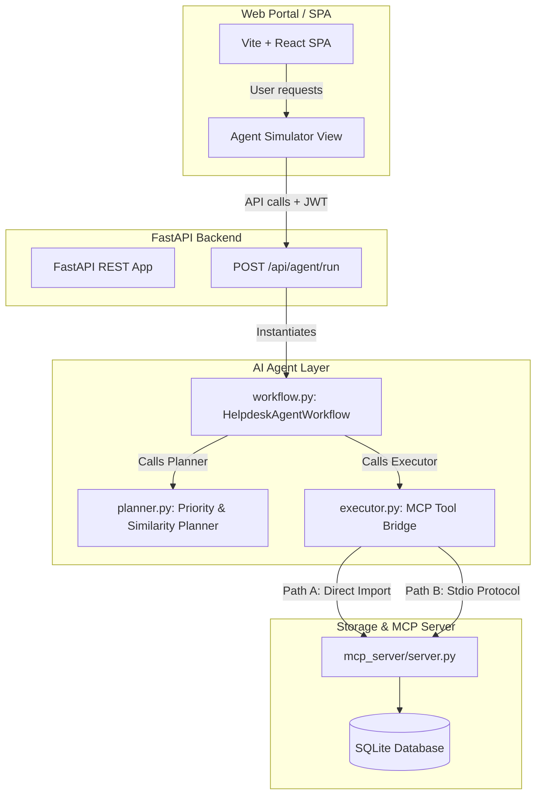
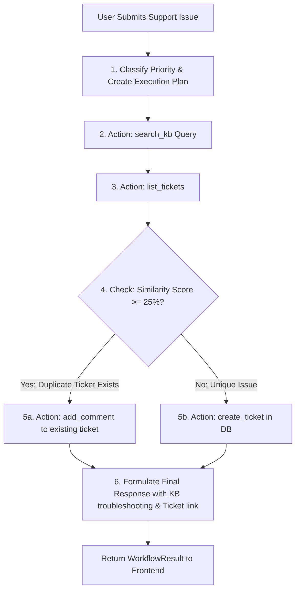

# AI Agent Helpdesk Architecture

This document details the system design, agent reasoning engine, tool interaction protocol, and design decisions for the AI Agent Layer added to the Ticket Management System. This architecture upgrades the system from a simple Model Context Protocol (MCP) server into an autonomous, stateful reasoning system suitable for portfolio demonstrations and technical interviews.

---

## 1. System Architecture

The agent acts as a middleware orchestration layer situated between the **FastAPI Backend API Router** and the **MCP Server Tools**. 

---

## 2. Workflow Decision Tree

When a user submits an issue (e.g., *"VPN is not working"*), the agent performs an autonomous multi-step reasoning loop (ReAct pattern) to resolve the issue:

---

## 3. Agent Lifecycle & ReAct Pattern

The agent is built using the **ReAct (Reason + Act)** pattern, where thoughts guide action selection, and tool observations guide subsequent thoughts.

### Detailed Step-by-Step Lifecycle:
1. **Instantiation:** The client invokes `/api/agent/run`. The backend initializes a clean `AgentState` object.
2. **Priority Classification:** The `planner.py` uses NLP keyword classification rules to immediately flag the issue as `LOW`, `MEDIUM`, `HIGH`, or `CRITICAL`.
3. **Reasoning Step 1 (Search KB):**
   - **Thought:** *"I should search the Knowledge Base to see if a troubleshooting article exists."*
   - **Action:** Calls `search_kb(query)` tool.
   - **Observation:** Retrieves relevant articles (e.g. Cisco AnyConnect VPN gateways and Duo MFA guidelines).
4. **Reasoning Step 2 (Check Existing Tickets):**
   - **Thought:** *"I must list existing tickets to see if another user reported this exact problem."*
   - **Action:** Calls `list_tickets()` tool.
   - **Observation:** Receives a list of open and in-progress tickets.
5. **Reasoning Step 3 (Resolution Branching):**
   - **Thought:** Computes similarity.
     - **If Duplicate:** *"Found similar ticket #2 with 85% Jaccard confidence. I will add a comment to ticket #2 instead of creating a duplicate."*
     - **If Unique:** *"No duplicate tickets found. I will create a new ticket with detected priority."*
   - **Action:** Invokes `add_comment()` or `create_ticket()`.
   - **Observation:** Receives confirmation of the database transaction.
6. **Reasoning Step 4 (Final Summary Response):**
   - **Thought:** *"The ticket operation was successful. I will summarize my actions and present KB instructions."*
   - **Action:** Outputs final user-facing text.

---

## 4. Key Algorithms

### A. Priority Classifier
Evaluates the request text against predefined dictionaries:
* **CRITICAL/HIGH:** Triggered by outages, production down, data loss, security breaches, or network offline.
* **MEDIUM:** Triggered by application errors, warning warnings, slow performance, latency, or bugs.
* **LOW:** General requests, documentation, how-to, setup questions, or license queries.

### B. Duplicate Ticket Detection
To prevent cluttering database support queues:
1. **Tokenization & Stop Word Filtering:** Cleans the user description and existing ticket details. Filters out common grammar words (*the, is, a, to, in, on, my, etc.*).
2. **Jaccard Word Similarity:** Computes overlap score:
   $$\text{Jaccard Similarity} = \frac{|A \cap B|}{|A \cup B|}$$
3. **Weighted Title Scoring:** Overlaps in title tokens are weighted higher (60% weight) than description bodies (40% weight).
4. **Substring Matching:** Performs fallback title substring matches. If a ticket matches above a $25\%$ threshold, it is marked as duplicate.

---

## 5. Design Decisions

1. **Dual-Mode Reasoning Engine (Zero-Config Portability):**
   * **Simulator Mode (Default):** Runs a local state machine that generates standard ReAct strings. This avoids paid API dependencies, executes instantly (<500ms), and makes the application 100% runnable out-of-the-box for offline testing.
   * **LLM Mode (Active when `GEMINI_API_KEY` is present):** Dynamically feeds the ReAct history into the Gemini API, allowing the LLM to decide the thoughts and select tools.
2. **Dual-Mode Executor:**
   * **Direct Import Mode:** Directly imports tool functions from the server module for high performance inside the FastAPI server.
   * **Protocol Connection Mode:** Spawns `server.py` as a stdio server process, connecting via standard JSON-RPC packets. This serves as a demonstration of true Model Context Protocol clients.
3. **State Isolation:** The `AgentState` object keeps execution data independent across API requests, preventing concurrent request leaks.

---

## 6. Interview Q&A Cheatsheet

### Q: Why use the ReAct pattern for this Helpdesk Agent?
> **Answer:** ReAct (Reasoning and Acting) allows the agent to intertwine reasoning steps with tool execution. Instead of executing actions blindly, the agent describes *why* it chooses a tool, observes the output, and adjusts its plan dynamically. In a Helpdesk, this guarantees that we search articles first, review existing open tickets second, and make a decision *only after* we have gathered all relevant contextual observations.

### Q: How did you implement similarity checking without expensive Vector Embeddings APIs?
> **Answer:** I implemented a custom Jaccard token similarity algorithm with stop-word cleaning. It computes the intersection and union of unique word tokens between tickets, applies a 60/40 weighted bias favoring titles, and enforces active-status filters (only matching open/in-progress tickets). This is lightweight, database-independent, has zero runtime costs, and works offline.

### Q: How does the Model Context Protocol (MCP) fit into this architecture?
> **Answer:** The MCP protocol decouples the tools from the LLM agent. The tools (`list_tickets`, `search_kb`, `create_ticket`, `add_comment`) are registered on the FastMCP Server. The agent acts as an MCP client. This allows standard agents (like Claude Desktop) to connect to `server.py` over stdio and use the exact same tools that our custom web agent orchestrates.
