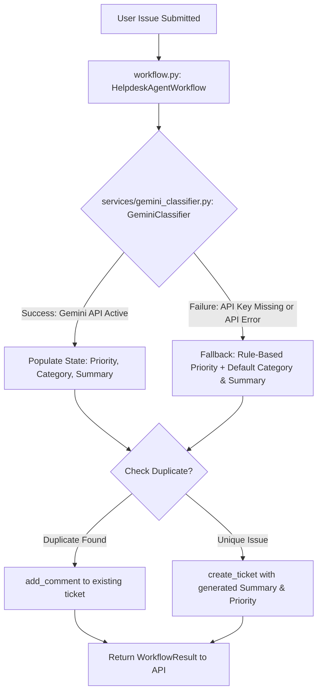
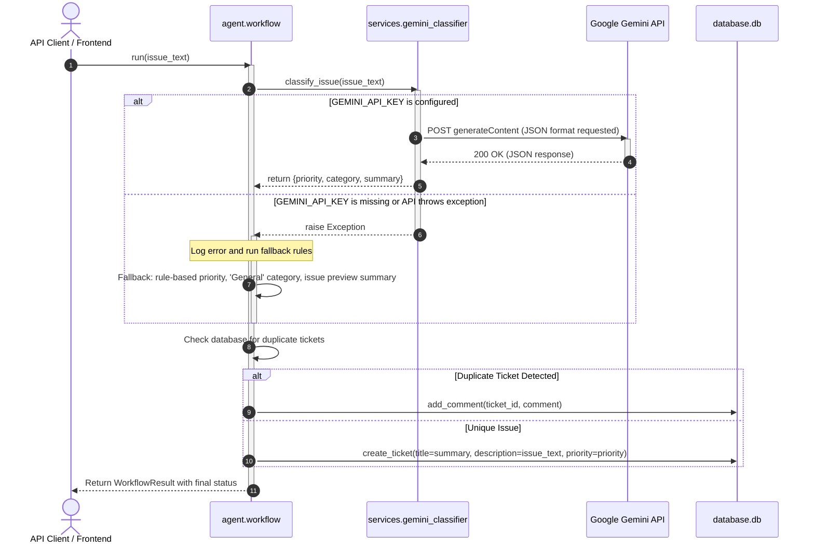

# Gemini-Powered Issue Classification Integration

This document outlines the architecture, flow, environment setup, error handling, and technical details of the Google Gemini API integration built for classifying incoming helpdesk tickets.

---

## 1. System Architecture Diagram

The `GeminiClassifier` service resides as a classification step inside the orchestrator flow. It intercepts user issues immediately before the ReAct loop runs.



---

## 2. API Sequence Flow

The following sequence diagram details the runtime execution path for issue processing.



---

## 3. Environment Setup

To enable active classification via Google Gemini API:

1. Create a `.env` file in the `project/` directory (if not already present):
   ```bash
   GEMINI_API_KEY="your_google_gemini_api_key_here"
   ```
2. Make sure the dependencies are installed:
   ```bash
   pip install -r requirements.txt
   ```
3. Restart the FastAPI server:
   ```bash
   uvicorn backend.main:app --reload --port 8000
   ```

---

## 4. Fallback & Error Handling Strategy

Production systems must never halt because of external dependency outages. The system handles errors using a strict **graceful degradation** policy:

* **Key Check validation:** If `GEMINI_API_KEY` is not present in the environment variables, the classifier raises a `ValueError` immediately, skipping API connection attempts to save latency.
* **API Failure recovery:** If the Gemini API returns a status 400/500, has invalid formatting, or encounters quota/network issues, the error is caught and logged at the workflow layer.
* **Local Fallback execution:** On failure, the system falls back to the local deterministic classifier (`planner.py:classify_priority`), sets the category to `"General"`, and sets the summary to the truncated issue text. Ticket creation and processing then proceed normally.

---

## 5. Technical Interview Q&A Cheatsheet

### Q: Why did you request JSON outputs from the Gemini model instead of letting it respond in raw text?
> **Answer:** Software integrations require consistent, structured data contracts to operate reliably. By using `response_mime_type: "application/json"` in Gemini's `generationConfig` (and designing a strict classification prompt), we guarantee that Gemini returns a parsable JSON block matching the keys `priority`, `category`, and `summary`. This avoids complex regex parsers and makes parsing reliable.

### Q: What is your fallback mechanism if the Gemini API goes down or hits a rate limit?
> **Answer:** The workflow wraps the `GeminiClassifier` call inside a `try-except` block. If Gemini fails, we catch the exception, log it to the telemetry/console logs, and invoke our rule-based local keyword classifier to determine priority. We assign a default category of `"General"` and use the first 80 characters of the user's issue text as the summary. This ensures 100% service uptime even if Google's API is completely down.

### Q: How did you implement this without changing the existing database tables or MCP tools?
> **Answer:** Decoupling classification logic from database storage is a key design pattern. We added `category` and `summary` as optional fields inside our in-memory `AgentState` schema. During ticket creation, we map the generated `summary` to the ticket `title` (which serves as a short summary), and map the `priority` to the ticket's priority. This preserves all existing database schema definitions, REST endpoint signatures, and MCP server contracts, preventing any breaking changes.
